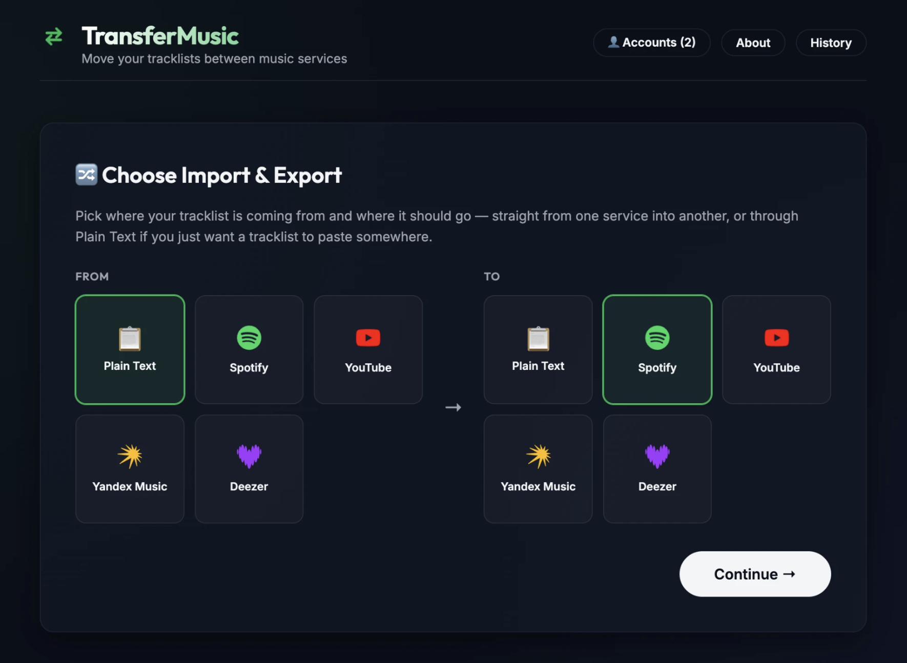

# 🔀 TransferMusic

Move playlists between **Spotify, YouTube, Yandex Music, and Deezer** — paste a plain-text tracklist and turn it into a playlist, export any playlist back to text, or bridge two services directly with bulk migration.

**Live demo:** [transfer-music-beta.vercel.app](https://transfer-music-beta.vercel.app)

[](https://github.com/yankvasya/transfer-music/actions/workflows/ci.yml)

[](LICENSE)



## What it does

- **Import**: paste `Artist - Title` lines and create a real playlist on Spotify, YouTube, Yandex Music, or Deezer — or paste a public Deezer playlist link instead and skip typing entirely, no login required to read it.
- **Export**: turn any of your playlists on those services into a plain-text tracklist (copy or download).
- **Direct bridge**: move one or more playlists straight from one service to another — no manual copy-paste tracklist step, with search, select-all, and filtering for large libraries.
- **Bulk migration**: queue up several playlists at once; the queue pauses (rather than silently skipping ahead) if a connector-wide rate limit or quota is hit.
- **Smart track matching**: every match is scored (normalized string similarity across title + artist, ignoring things like "(Live)"/"(Remaster)" suffixes). High-confidence matches are added automatically; uncertain ones land in a "Needs Review" queue where you pick the right candidate or reject them all.
- **Resumable imports**: progress is checkpointed as it runs — a rate limit, a quota cap, a closed tab, or even a crash mid-import all leave an accurate, resumable entry in History instead of losing work.
- **Duplicate detection**: two tracklist lines that resolve to the same actual track only get added once.
- **Import history**: every run is saved locally (with resume/retry for anything incomplete), independent of any backend.

## Why these four services

Each one needed a different auth flow, which is most of why this project exists as a learning exercise:

| Service | Auth | Notes |
|---|---|---|
| Spotify | OAuth PKCE, shared app | Direct browser calls |
| YouTube | OAuth PKCE, shared app | Data API v3; import capped at ~100 searches/day on the free tier, handled via a circuit breaker |
| Yandex Music | OAuth Device Flow, shared app | No CORS support server-side — proxied through a small Vercel function |
| Deezer | OAuth (no PKCE), shared app | Also proxied — missing `Access-Control-Allow-Origin` blocks direct calls |

All four now log in through this app's own shared credentials — visitors just click "Login with X," no developer account or Client ID of their own required. The tradeoff: Spotify caps an unverified app at 25 total users and YouTube's `youtube` scope caps an unverified app at 100, both shared across every visitor this deployment ever gets, until going through that platform's app-review process. Deployed here anyway as the more realistic default for a project people are actually meant to try; if you fork this and expect real traffic, budget for that review.

A dozen other services were researched and deliberately **not** added — VK Music (no OAuth path for the audio scope at all), Apple Music / SoundCloud / Qobuz (a paid developer subscription just to register an app), Amazon Music / Anghami / Pandora (closed partner programs, no self-serve signup), Tidal (approval-gated, and third-party playlist writes aren't available yet), Audiomack (no self-serve app registration despite a real free API), Boomplay / SberZvuk (no public developer API found at all). Each has its own tracked issue with the specific reasoning — see [issues labeled `enhancement`](https://github.com/yankvasya/transfer-music/issues?q=is%3Aissue+label%3Aenhancement).

## Tech stack

- **React 19 + TypeScript + Vite**, `react-router-dom` (query-param routing, not path segments — adding a service is a new `?type=` value, not new routes)
- **Vercel serverless functions** (Web Fetch API handlers) for the services that need a CORS/auth proxy
- **Vitest + React Testing Library** — 138 tests, covering the core import loop (rate limiting, quota handling, resumability, duplicate detection, manual review), the bulk migration queue, and history persistence
- **GitHub Actions CI** — typecheck, build, lint, and the full test suite on every PR
- No backend database — playlists and history live in the actual music services and the browser's `localStorage`, respectively

### Architecture in brief

Every service implements the same two interfaces — `DestinationConnector` (`createPlaylist` / `searchTrack` / `addTracks`) and `SourceConnector` (`listPlaylists` / `getPlaylistName` / `getPlaylistTrackLines`) — so `ImporterProgress`, `ExportView`, and the bridge queue are all generic components driven by whichever connector gets passed in, not four sets of near-duplicate screens. Matching confidence is scored in a single dependency-free utility (`src/utils/matching.ts`): above `0.85` auto-accepts, between `0.5` and `0.85` goes to manual review, below that is a miss.

## Getting started

```bash
npm install
cp .env.example .env   # fill in your own app credentials, see below
npm run dev
```

### Credentials

Every service now runs on one shared app instead of a per-visitor Client ID — see `.env.example` for the full list. Short version:

- **Spotify / YouTube**: register your own app (Spotify Developer Dashboard / Google Cloud Console) and set `VITE_SPOTIFY_CLIENT_ID`, `VITE_SPOTIFY_REDIRECT_URI`, `VITE_YOUTUBE_CLIENT_ID`, `VITE_YOUTUBE_REDIRECT_URI` in `.env`.
- **Yandex Music**: uses a shared OAuth app — the proxy functions in `api/` need `YANDEX_CLIENT_ID` / `YANDEX_CLIENT_SECRET` set as server-side env vars (in your Vercel project settings, not `.env`).
- **Deezer**: register an app at `developers.deezer.com/myapps`. The App ID is public (`VITE_DEEZER_APP_ID`); the Secret Key must be server-side only (`DEEZER_APP_SECRET`, set in Vercel, never in `.env`/committed anywhere).

### Scripts

```bash
npm run dev       # start the dev server
npm run build     # typecheck + production build
npm run lint       # oxlint
npm test           # run the full Vitest suite
npm run preview   # serve the production build locally
```

## Deploying

Built for Vercel: `vercel.json` rewrites everything except `/api/*` to `index.html` (client-side routing via `BrowserRouter`), and the two proxy endpoints ship as Vercel serverless functions automatically.

## Self-hosting

The `api/` handlers use the Web Fetch API shape Vercel's runtime expects (`export default { fetch(request) }`) — `server.ts` is a small always-on Node process that runs those same, unmodified handlers outside of Vercel, translating between Node's `http` module and the Web `Request`/`Response` objects they expect.

- `npm run build` produces the static frontend in `dist/`.
- `npm run start:api` runs the API proxy on `process.env.PORT` (default `3001`), loading credentials from a `.env` file via `dotenv` — see `.env.example` for what's required. For a persistent process, something like `pm2 start "npx tsx server.ts" --name transfermusic-api` works too.
- Point a reverse proxy (e.g. Caddy) at both: serve `dist/` as static files, and forward `/api/*` to `http://localhost:3001`.

## License

[MIT](LICENSE)
