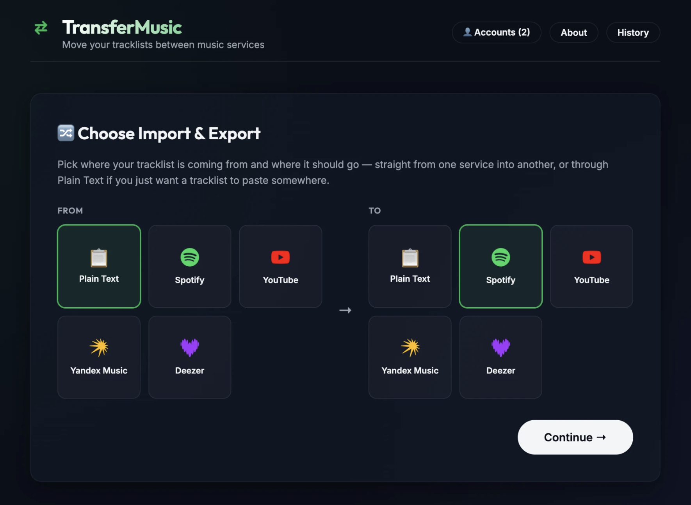

# 🔀 TransferMusic

Move playlists between **Spotify, YouTube, Yandex Music, and Deezer** — paste a plain-text tracklist and turn it into a playlist, export any playlist back to text, or bridge two services directly with bulk migration.

**Live demo:** [transfermusic.yankvasya.dev](https://transfermusic.yankvasya.dev/)

## What it does

- **Import** — paste `Artist - Title` lines (or a public Deezer playlist link) and create a real playlist on Spotify, YouTube, Yandex Music, or Deezer.
- **Export** — turn any of your playlists on those services into a plain-text tracklist (copy or download).
- **Direct bridge** — move one or more playlists straight from one service to another, with search, select-all, and filtering for large libraries.
- **Bulk migration** — queue up several playlists at once; the queue pauses (rather than silently skipping ahead) if a connector-wide rate limit or quota is hit.
- **Smart track matching** — every match is scored by normalized string similarity across title + artist. High-confidence matches are added automatically; uncertain ones land in a "Needs Review" queue.
- **Resumable imports** — progress is checkpointed as it runs, so a rate limit, closed tab, or crash leaves an accurate, resumable entry in History instead of losing work.
- **Import history** — every run is saved locally (with resume/retry for anything incomplete), independent of any backend.

## Tech stack

- **React 19 + TypeScript + Vite**, with `react-router-dom` (query-param routing)
- **Vercel serverless functions** for the services that need a CORS/auth proxy
- **Vitest + React Testing Library** for testing
- **GitHub Actions CI** — typecheck, build, lint, and the full test suite on every PR
- No backend database — playlists and history live in the music services and the browser's `localStorage`

## Contributing

See [CONTRIBUTING.md](CONTRIBUTING.md).

## License

[MIT](LICENSE)
